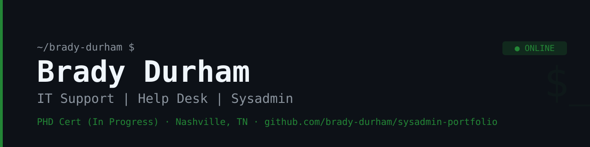

[README.md](https://github.com/user-attachments/files/29442028/README.md)
# Brady Durham — Systems Administration Portfolio

## About

Hands-on sysadmin projects built in a home lab environment. Transitioning into IT with a focus on help desk and systems administration. Practical experience with Linux, Windows Server, Active Directory, networking, Docker, and self-hosted web infrastructure.

---

## Environment

- **Hypervisor:** Dell OptiPlex 5060 (32GB RAM) running Proxmox VE
- **VMs:** Windows 11 Pro, Ubuntu Desktop, Windows Server 2022 (DC01 — LAB.local), Ubuntu Server, EVE-NG
- **Daily Driver:** Dell OptiPlex 7050 (32GB RAM, 1TB NVMe) — Ubuntu 24.04 / Windows 11 dual boot
- **Network Lab:** 2x Cisco Catalyst 2960 switches, 2x Cisco 1841 routers (physical lab — deferred until post-CCNA)

---

## Projects

### Linux

| Project | Description |
|---|---|
| [Linux Ticket: User Management & File Permissions](https://github.com/brady-durham/linux-ticket-01-user-permissions) | Help desk ticket — add users, expire passwords, create confidential directory with group permissions |

### Self-Hosted Web Infrastructure

| Project | Description |
|---|---|
| Nginx Portfolio Site | Installed and configured Nginx on Ubuntu Server VM. Built and deployed a personal IT portfolio site using HTML and CSS. Configured static IP via Netplan. Site served at http://10.0.0.161 on local network. |

### Ticketing System

| Project | Description |
|---|---|
| [Peppermint Ticketing Lab](https://github.com/brady-durham/ticketing-lab-01-peppermint) | Deployed Peppermint help desk ticketing system via Docker Compose on Ubuntu Server. Troubleshot Docker Compose v1/v2 incompatibility and PostgreSQL configuration issues. |

### Active Directory / Windows Server

| Project | Description |
|---|---|
| Proxmox Homelab | Windows Server 2022 configured as Domain Controller for LAB.local. Active Directory, DNS, Group Policy. SSH key-based auth between VMs, RDP via Remmina. Full write-up in repo README. |

---

## Currently Working On

- CCNA certification — Zero to CCNA (zerotoit.com) | Live Bootcamp starting July 4, 2026
- Expanding self-hosted web infrastructure (second Nginx virtual host)
- Cert roadmap: CCNA → RHCSA → RHCE

---

## Contact

- GitHub: [@brady-durham](https://github.com/brady-durham)
- LinkedIn: [linkedin.com/in/brady-a-durham](https://linkedin.com/in/brady-a-durham)
- Email: bradydurham@protonmail.com
